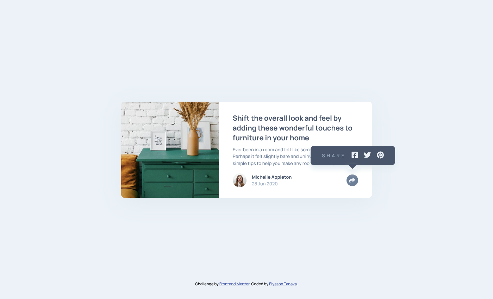

# Frontend Mentor - Article preview component solution

This is a solution to the [Article preview component challenge on Frontend Mentor](https://www.frontendmentor.io/challenges/article-preview-component-dYBN_pYFT). 


## Table of contents

- [Overview](#overview)
  - [The challenge](#the-challenge)
  - [Screenshot](#screenshot)
  - [Links](#links)
- [My process](#my-process)
  - [Built with](#built-with)
  - [What I learned](#what-i-learned)
- [Author](#author)


## Overview

### The challenge

Users should be able to:

- View the optimal layout for the component depending on their device's screen size
- See the social media share links when they click the share icon

### Screenshot




### Links

- Solution URL: [Solution Repo](https://github.com/elyssontanaka/9_article_preview_component)
- Live Site URL: [Article Preview Component](https://elyssontanaka.github.io/9_article_preview_component/)


## My process

### Built with

- Semantic HTML5 markup
- CSS custom properties
- Flexbox
- Mobile-first workflow
- JavaScript


### What I learned

This project has so many CSS details and took up most of my time. I practiced some fundamental concepts and just a little bit of Javascript. I learned to make "Speech Bubbles" which is an interesting idea to use on future projects.

The CSS code I used to make the "Speech Bubble":

```css
    .share-container {
        position: relative;
        width: 18.5rem;
        height: 4.15rem;
        bottom: 9rem;
        left: 17rem;
        display: none;
        box-shadow: 0 10px 15px rgb(225, 235, 240);
        border-radius: .7rem;
    }

    /* making the speech bubble */
    .share-container::before {
        content: "";
        position: absolute;
        width: 0;
        height: 0;
        border-right: 1rem solid transparent;
        border-top: 1rem solid var(--very-dark-grayish-blue);
        border-left: 1rem solid transparent;
        top: 4rem;
        left: 8.2rem;
        box-shadow: 0 10px 15px rgb(225, 235, 240);
    }
```


## Author

- Website - [Elysson Tanaka](https://elyssontanaka.github.io/)
- Frontend Mentor - [@elyssontanaka](https://www.frontendmentor.io/profile/elyssontanaka)